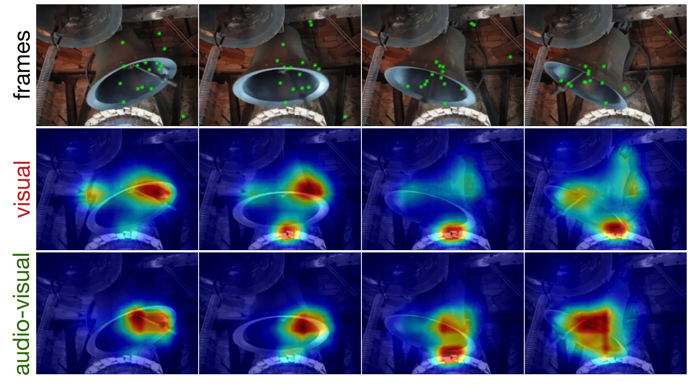

# STAViS: Spatio-Temporal AudioVisual Saliency Network

Code repository for the paper:
  
**STAViS: Spatio-Temporal AudioVisual Saliency Network**  
[Antigoni Tsiami](http://cvsp.cs.ntua.gr/antigoni/), 
[Petros Koutras](http://cvsp.cs.ntua.gr/pkoutras/), 
[Petros Maragos](http://cvsp.cs.ntua.gr/maragos/)  
CVPR 2020  
[[paper](http://openaccess.thecvf.com/content_CVPR_2020/papers/Tsiami_STAViS_Spatio-Temporal_AudioVisual_Saliency_Network_CVPR_2020_paper.pdf)][[supp](http://openaccess.thecvf.com/content_CVPR_2020/supplemental/Tsiami_STAViS_Spatio-Temporal_AudioVisual_CVPR_2020_supplemental.zip)][[arxiv](https://arxiv.org/abs/2001.03063)][[project page](http://cvsp.cs.ntua.gr/research/stavis/)]



## Citation

If you use this code or the trained models, please cite the following:
```bibtex
@InProceedings{Tsiami_2020_CVPR,
author = {Tsiami, Antigoni and Koutras, Petros and Maragos, Petros},
title = {STAViS: Spatio-Temporal AudioVisual Saliency Network},
booktitle = {IEEE/CVF Conference on Computer Vision and Pattern Recognition (CVPR)},
month = {June},
year = {2020}
} 
```

## Requirements

* Python 3 : tested with 3.5
* [PyTorch](http://pytorch.org/) : tested with versions from 0.4 to 1.4.0
* GPU support (ideally multiple) : tested with 4 NVIDIA GTX1080Ti or RTX2080Ti
* MATLAB (for computing the evaluation metrics) : tested with R2015a or newer

You can install the required python packages with the command: 
```bash
pip install -r requirements.txt --user
```

## Fetch data and models

For the training and evaluation of the STAViS network we have employed 5 publicly available datasets with eyetracking annotations. 
We encourage those interested to visit the original sources and site the appropriate references if they use these data.

1. [AVAD](https://sites.google.com/site/minxiongkuo/home)
2. [Coutrot databases](http://antoinecoutrot.magix.net/public/databases.html)
3. [DIEM](https://thediemproject.wordpress.com/videos-and%c2%a0data/)
4. [SumMe](http://cvsp.cs.ntua.gr/research/aveyetracking/) ([Original videos](https://gyglim.github.io/me/vsum/index.html#benchmark))
5. [ETMD](http://cvsp.cs.ntua.gr/research/aveyetracking/)

For the easily reproduction of STAViS results we provide the extracted video frames and audio clips as well as the preprocessed ground truth saliency maps.

Please visit the [project page](http://cvsp.cs.ntua.gr/research/stavis/) to download the pre-trained models as well as the data and the related files.

You can also run the following script that downloads and extract all the required meterial: 
```bash
bash fetch_data.sh
```

## Run training and testing code

Assume the structure of data directories is that provided by the script ```fetch_data.py```.

```misc
STAViS/
  data/
    video_frames/ 
        .../ (directories of datasets names) 
    video_audio/ 
        .../ (directories of datasets names)
    annotations/ 
        .../ (directories of datasets names) 
    fold_lists/
        *.txt (lists of datasets splits)
    pretrained_models/
        stavis_visual_only/
            visual_split1_save_60.pth
            visual_split2_save_60.pth
            visual_split3_save_60.pth
        stavis_audiovisual/
            audiovisual_split1_save_60.pth
            audiovisual_split2_save_60.pth
            audiovisual_split3_save_60.pth
        resnet-50-kinetics.pth
        soundnet8.pth
```

Confirm all options for the STAViS parameters:
```bash
python main.py -h
```
If you use less than our default 4 GPUs you should modify the ```--gpu_devices 0,1,2,3 --batch_size 128 --n_threads 12``` accordingly.

* Train STAViS audiovisual models for all splits and produce the resulting saliency maps for the test sets:
```bash
bash run_all_splits_audiovisual_train_test.sh
```

* Produce saliency maps for all splits' test sets using our trained STAViS audiovisual models:
```bash
bash run_all_splits_audiovisual_test.sh
```

* Produce saliency maps for all splits' test sets using our trained STAViS visual only models (for comparisons):
```bash
bash run_all_splits_visual_only_test.sh
```

## Run evaluation code

For the computation of the diffenent measures employed in the evaluation we used MATLAB functions from (https://github.com/cvzoya/saliency/tree/master/code_forMetrics):
```bash
git clone https://github.com/cvzoya/saliency.git
mv saliency/code_forMetrics ./eval_code/
rm -rf saliency
```
The main evaluation script is ```compute_all_databases.sh``` that runs with the full root path and the path where network prediction are saved as arguments. 
For example, if the project root folder is ```/home/test/STAViS``` and the experiment's predictions are saved at ```experiments/audiovisual_train_test/```:
```bash
sh compute_all_databases.sh /home/test/STAViS experiments/audiovisual_train_test/
```
This script creates 6 scripts, one for each database, containing individual Matlab experiments for each video evaluation.
(Note that, if familiar with a framework like Grid Engine, these scripts can run in parallel, to save computational time.)
The results per video and split are saved in the experiment folder, under the name results_per_video.
Next, after all evaluations are finished, results are gathered together, per database, 
and a final result for each metric is printed on the screen and on a file called final_results_$databasename.txt

## References
[1] [A. Tsiami, P. Koutras and P. Maragos. STAViS: Spatio-Temporal AudioVisual Saliency Network. CVPR 2020.](http://openaccess.thecvf.com/content_CVPR_2020/html/Tsiami_STAViS_Spatio-Temporal_AudioVisual_Saliency_Network_CVPR_2020_paper.html)

[2] [P. Koutras and P. Maragos. SUSiNet: See, Understand and Summarize it. CVPRW 2019.](http://openaccess.thecvf.com/content_CVPRW_2019/html/MBCCV/Koutras_SUSiNet_See_Understand_and_Summarize_It_CVPRW_2019_paper.html)

[3] [K. Hara, H. Kataoka and Y. Satoh. Can Spatiotemporal 3D CNNs Retrace the History of 2D CNNs and ImageNet?. CVPR 2018.](http://openaccess.thecvf.com/content_cvpr_2018/html/Hara_Can_Spatiotemporal_3D_CVPR_2018_paper.html) 

[4] [Y. Aytar, C. Vondrick and A Torralba. SoundNet: Learning Sound Representations from Unlabeled Video. NIPS 2016.](https://arxiv.org/abs/1610.09001)

## License

Our code is released under the MIT license.

Please contact Antigoni Tsiami at [antsiami@cs.ntua.gr](mailto:antsiami@cs.ntua.gr) in case you have any questions or suggestions.
